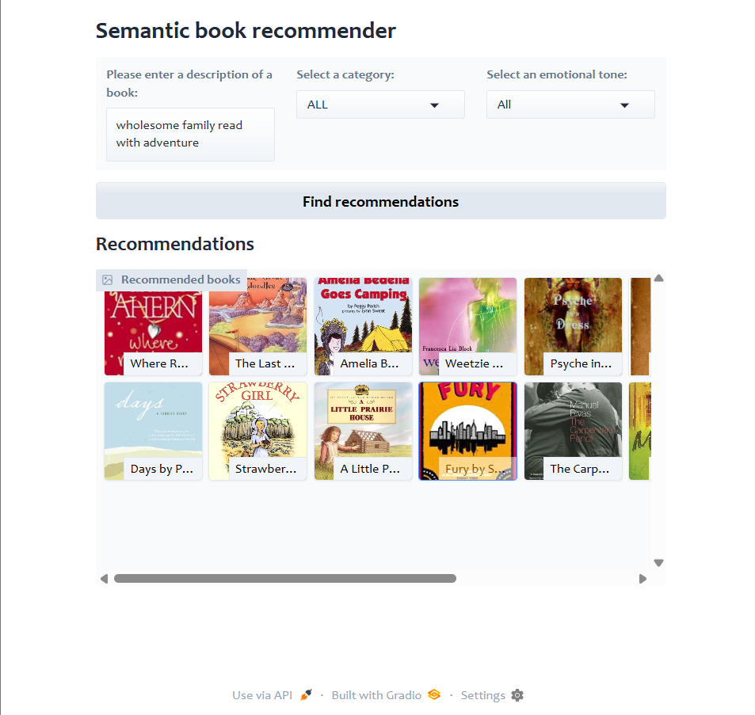
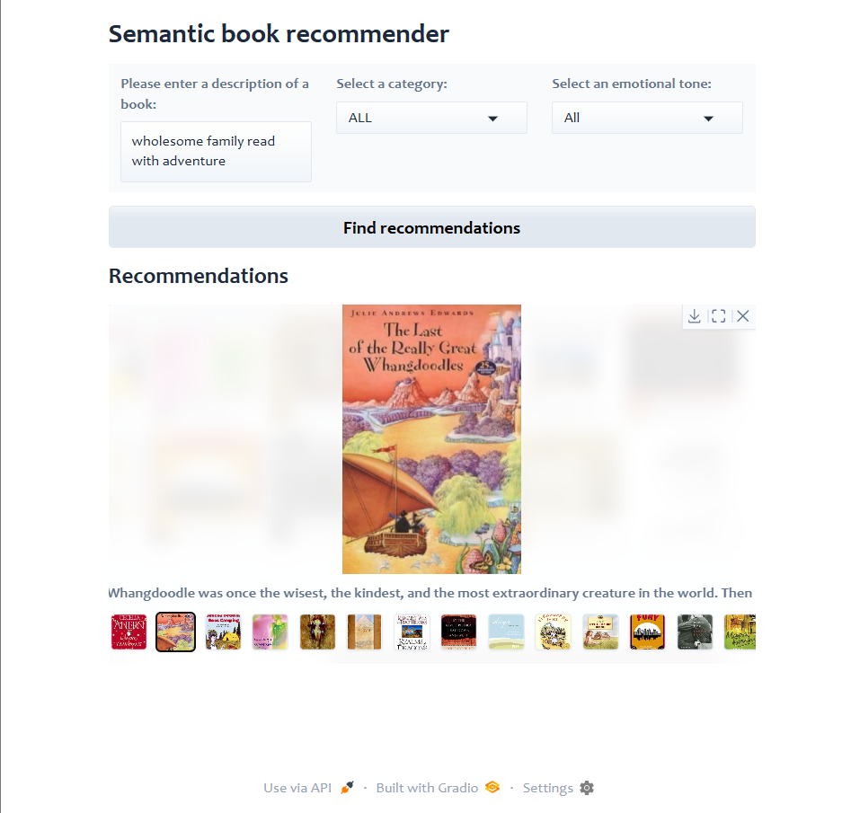

# 📚 Book Recommendation System

> A practical, end‑to‑end book recommender that combines data cleaning, sentiment analysis, text classification, and vector similarity search with a simple Gradio UI.

---

## 🔎 Overview

This project builds a content‑based **Book Recommendation System**. It cleans and enriches book metadata, classifies descriptions, extracts sentiment from reviews, and indexes everything into a vector store for **semantic search** and **recommendations**. A lightweight **Gradio** app lets you try queries like *“books about mental-wellbeing”* or *“books to teach children about nature.”*

---

## ✨ Features

* **Semantic search** with sentence embeddings + **ChromaDB** vector store
* **Text classification** of book descriptions for better filtering
* **Sentiment & emotion tagging** for reviews to improve ranking
* **Cleaned dataset** with unified fields and tags
* **Gradio UI** for interactive querying and quick demos

---

**sample query:**

* *“wholesome family read with adventure”*

---

## 🧰 Tech Stack

* **Python**: pandas, numpy, seaborn
* **NLP/Embeddings**: transformers, sentence‑transformers (Hugging face)
* **Vector Store**: chromadb
* **Orchestration/Utils**: langchain , tqdm, regex
* **UI**: gradio
* **Notebooks**: Jupyter

---

## 📄 License

MIT License — see `LICENSE` for details.

---
